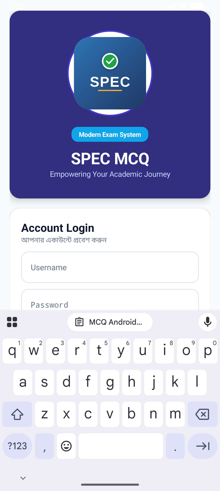
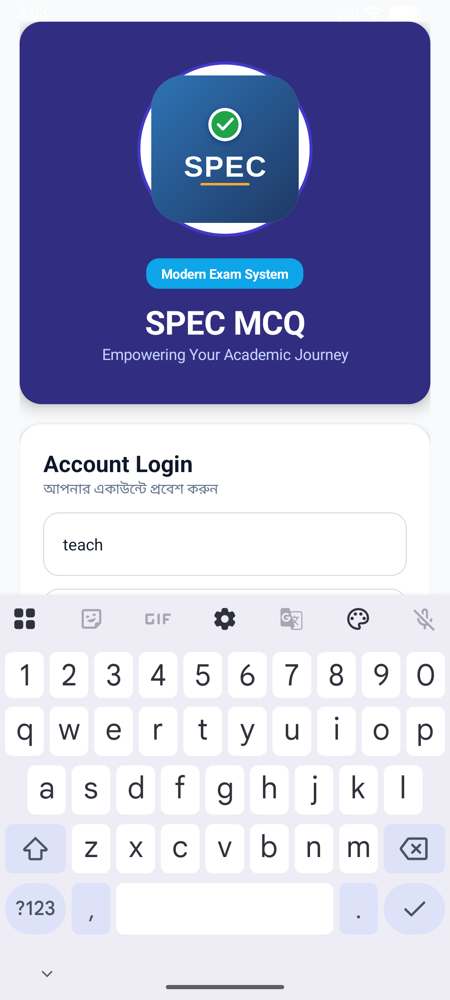
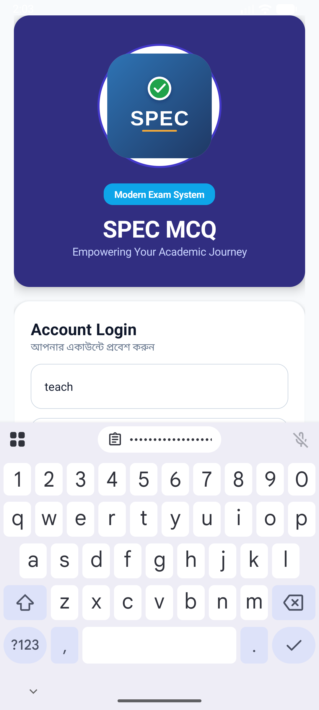
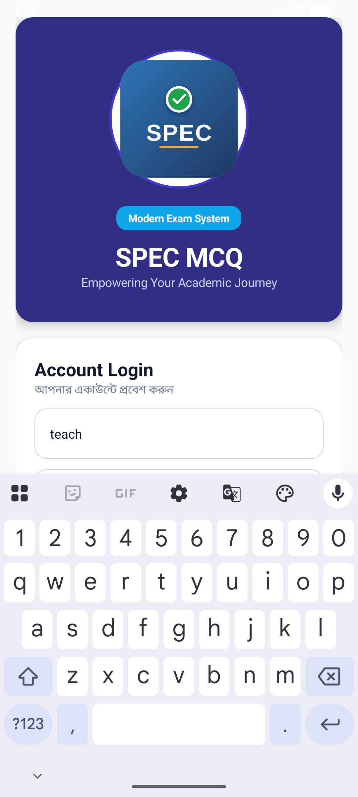
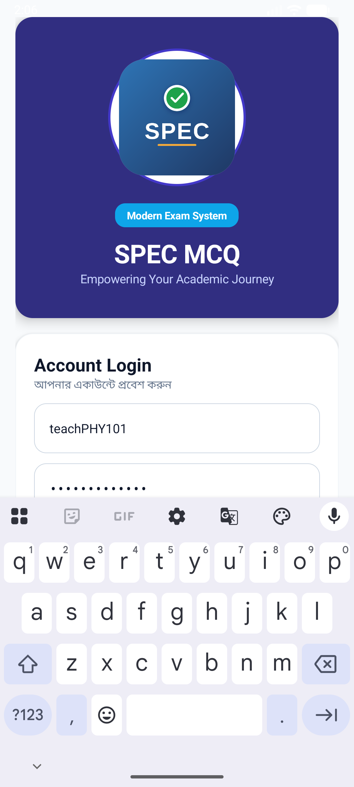
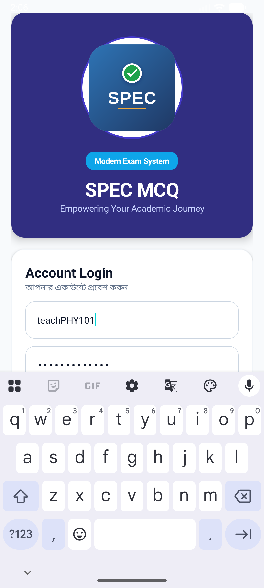

# SPEC MCQ - Presentation Guide & Project Overview 🎓

এই গাইডটি আপনাকে **৭ পৃষ্ঠার একটি প্রফেশনাল প্রেজেন্টেশন** তৈরি করতে সাহায্য করবে। প্রতিটি পৃষ্ঠার জন্য প্রয়োজনীয় স্ক্রিনশট এবং বিস্তারিত তথ্য নিচে দেওয়া হলো।

---

## 📽 Presentation Structure (7 Pages)

### 📄 Page 1: Introduction & Welcome Screen
**মূল বিষয়:** অ্যাপের পরিচিতি এবং আকর্ষণীয় এন্ট্রি ইন্টারফেস।
*   **ফিচার:** কাস্টম লোগো (SPEC Logo), মডার্ন কালার প্যালেট, এবং সিকিউর গেটওয়ে।
*   **স্ক্রিনশট:** 
*   **মার্কিং গাইড:** 
    *   **🔴 লোগো:** ব্র্যান্ডিং আইডেন্টিটি।
    *   **🔵 লগইন ফর্ম:** ইউজার অ্যাক্সেস কন্ট্রোল।

---

### 📄 Page 2: Role-Based Registration
**মূল বিষয়:** শিক্ষক এবং শিক্ষার্থীদের জন্য আলাদা রেজিস্ট্রেশন সিস্টেম।
*   **ফিচার:** মাল্টি-রোল সাপোর্ট (Teacher/Student), BCrypt পাসওয়ার্ড এনক্রিপশন।
*   **স্ক্রিনশট:** 
*   **মার্কিং গাইড:** 
    *   **🟢 Student Register:** শিক্ষার্থীদের জন্য আকাশী নীল বাটন।
    *   **🟣 Teacher Register:** শিক্ষকদের জন্য ইন্ডিগো বাটন।

---

### 📄 Page 3: Admin Power Dashboard
**মূল বিষয়:** শিক্ষকদের ম্যানেজমেন্ট সেন্টার।
*   **ফিচার:** রিয়েল-টাইম স্ট্যাটিস্টিকস (Total Subjects, Questions, Students), কনটেস্ট শিডিউলিং।
*   **স্ক্রিনশট:** 
*   **মার্কিং গাইড:** 
    *   **📊 Stats Row:** ড্যাশবোর্ডের মূল সামারি।
    *   **⚙️ Create Subject:** টাইম এবং ডেট পিকারসহ কনটেস্ট মোড।

---

### 📄 Page 4: Bulk MCQ Management (New!)
**মূল বিষয়:** দ্রুত এবং ডাইনামিক প্রশ্ন যোগ করার পদ্ধতি।
*   **ফিচার:** 'Add Another Question' বাটন, ডাইনামিক কার্ড ভিউ, এবং এক ক্লিকে বাল্ক সেভ।
*   **স্ক্রিনশট:** 
*   **মার্কিং গাইড:** 
    *   **➕ Add Button:** একাধিক প্রশ্নের ঘর তৈরি করা।
    *   **💾 Save All:** একসাথে সব প্রশ্ন ডাটাবেসে সেভ করা।

---

### 📄 Page 5: Student Exam Finder & Portal
**মূল বিষয়:** শিক্ষার্থীদের জন্য সহজ পরীক্ষা খোঁজার পদ্ধতি।
*   **ফিচার:** সাবজেক্ট কোড সার্চ, রেজিস্টার্ড কনটেস্ট লিস্ট।
*   **স্ক্রিনশট:** 
*   **মার্কিং গাইড:** 
    *   **🔍 Search Box:** টিচারের দেওয়া কোড দিয়ে ইনস্ট্যান্ট সার্চ।
    *   **📋 Registered Contests:** নিজের নিবন্ধিত সব পরীক্ষার তালিকা।

---

### 📄 Page 6: Live Contest & Security
**মূল বিষয়:** লাইভ পরীক্ষা চলাকালীন কন্ট্রোল এবং সিকিউরিটি।
*   **ফিচার:** লাইভ কাউন্টডাউন টাইমার, সরাসরি জয়েনিং (Direct Join), এবং ওয়ান-টাইম সাবমিশন।
*   **স্ক্রিনশট:** 
*   **মার্কিং গাইড:** 
    *   **⏱ Countdown Timer:** সময় শেষ হওয়ার রিয়েল-টাইম সতর্কবার্তা।
    *   **🔒 Restricted Access:** একবার সাবমিট করার পর পুনরায় প্রবেশের বাধা।

---

### 📄 Page 7: Smart Notifications & Results
**মূল বিষয়:** ফলাফল ঘোষণা এবং ইউজার এঙ্গেজমেন্ট।
*   **ফিচার:** হিডেন রেজাল্ট (কনটেস্ট শেষ হওয়ার আগে রেজাল্ট দেখা যাবে না), পুশ-লাইক নোটিফিকেশন হিস্ট্রি।
*   **স্ক্রিনশট:** 
*   **মার্কিং গাইড:** 
    *   **🔔 Bell Icon:** সকল আপডেটের কেন্দ্রবিন্দু।
    *   **📝 Status Update:** "Results are now available" নোটিফিকেশন।

---

## 🛠 Technical Highlights for Presentation
*   **Architecture:** MVVM (Model-View-ViewModel).
*   **Database:** SQLite (Offline Server Mode).
*   **UI:** 100% Code-based dynamic UI using Material 3.
*   **Stability:** সড়া বাগ ফিক্সিং এবং হাই-পারফরম্যান্স অপ্টিমাইজেশন।

---
**Developed by:** SPEC Team  
**Goal:** Making digital examinations secure, easy, and internet-independent.
